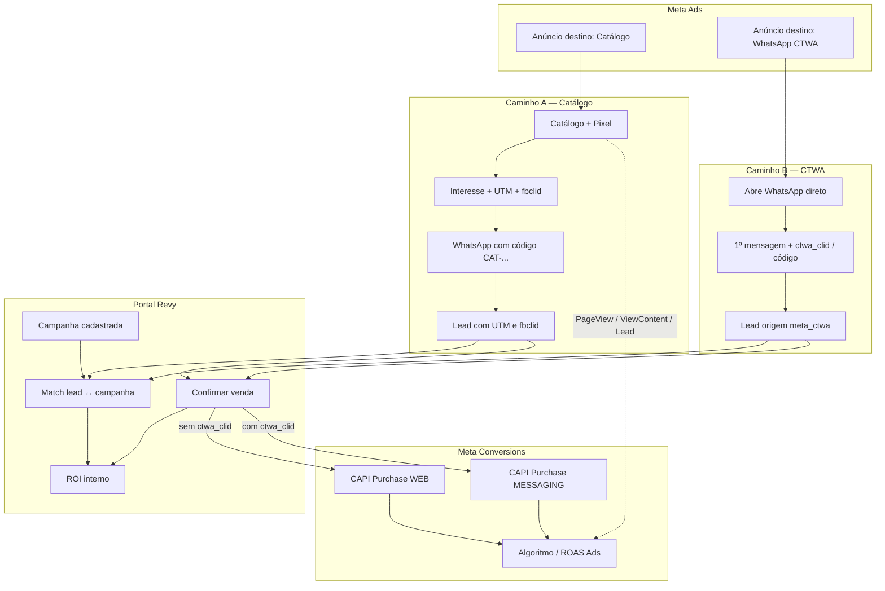

# Fluxo completo: UTM, Pixel, CTWA, WhatsApp e Meta

Guia detalhado de ponta a ponta: como o anúncio vira lead no WhatsApp, como o Revy atribui campanha (ROI interno) e como a Meta recebe sinais (Pixel + CAPI) para medir e otimizar.

**Relacionado:**

- [Guia da loja — tráfego pago](trafego-pago-loja.md)
- PDFs: `tutorial-revy-trafego-setup.pdf`, `tutorial-revy-trafego-fluxos.pdf`

---

## Sumário

1. [Peças do sistema](#1-peças-do-sistema)
2. [Visão dos dois funis](#2-visão-dos-dois-funis)
3. [Caminho A — Catálogo + UTM + Pixel](#3-caminho-a--anúncio--catálogo--whatsapp-utm--pixel)
4. [Caminho B — CTWA (WhatsApp direto)](#4-caminho-b--anúncio--whatsapp-direto-ctwa)
5. [Match da campanha no Revy](#5-match-da-campanha-no-revy)
6. [O que a Meta aprende (algoritmo)](#6-o-que-a-meta-aprende-algoritmo)
7. [Payloads e dados técnicos](#7-payloads-e-dados-técnicos)
8. [Linha do tempo lado a lado](#8-linha-do-tempo-lado-a-lado)
9. [Checklist de medição](#9-checklist-de-medição)
10. [Diagrama final “uma página”](#10-diagrama-final-uma-página)
11. [Resumo](#11-resumo)
12. [Perguntas frequentes](#12-perguntas-frequentes)

---

## 1. Peças do sistema

```text
┌─────────────────────────────────────────────────────────────────────────┐
│  META ADS (gasta e veicula o anúncio)                                   │
│  - clique web (fbclid)  |  clique WhatsApp (ctwa_clid)                   │
└───────────────┬─────────────────────────────┬───────────────────────────┘
                │                             │
                ▼                             ▼
┌───────────────────────────┐   ┌─────────────────────────────────────────┐
│  CATÁLOGO (site)          │   │  WHATSAPP (CTWA direto)                 │
│  - Pixel (browser)        │   │  - sem Pixel de página                  │
│  - UTM na URL             │   │  - código na msg (opcional)             │
│  - interesse → wa.me      │   │  - Evolution/WA manda sinais            │
└─────────────┬─────────────┘   └──────────────────┬──────────────────────┘
              │                                    │
              └────────────────┬───────────────────┘
                               ▼
                 ┌─────────────────────────┐
                 │  CHATBOT (leads/msgs)   │
                 │  UTM, fbclid, ctwa_*    │
                 └────────────┬────────────┘
                              ▼
                 ┌─────────────────────────┐
                 │  PORTAL (campanhas,     │
                 │  vendas, ROI, CAPI)     │
                 └────────────┬────────────┘
                              ▼
                 ┌─────────────────────────┐
                 │  META CAPI (servidor)   │
                 │  Purchase web OU msg    │
                 └─────────────────────────┘
```

| Peça | Função em uma linha |
|------|---------------------|
| **UTM** | Etiqueta da campanha **no Revy** (ROI interno) |
| **Pixel** | Eventos no **browser** do catálogo → Meta |
| **CTWA** | Anúncio que abre o **WhatsApp** sem site |
| **CAPI** | Eventos pelo **servidor** (Purchase na venda) |
| **Campanha Revy** | Cadastro com `utm_campaign` / `codigo_ctwa` / `meta_campaign_id` |
| **Lead** | Pessoa no Chatbot com first/last touch e chaves de match |
| **Venda confirmada** | Gatilho do Purchase pra Meta + snapshot no ROI |

### O que cada coisa **não** é

| Conceito | Não confunda com |
|----------|------------------|
| UTM | Não é enviada à Meta para otimizar; é nome interno da campanha no Revy |
| Pixel | Não grava UTM no lead; não casa campanha com venda; não manda Purchase sozinho |
| CTWA | Não alimenta PageView/ViewContent/Lead do site |
| Código `Cód: RV-JUL` | Não substitui `ctwa_clid` na API da Meta; serve ao match **Revy** |
| CAPI | Não é o script `fbq` no browser; é envio server-side com o **mesmo Pixel ID** |

---

## 2. Visão dos dois funis



### Comparação rápida

| | Caminho A — Catálogo | Caminho B — CTWA |
|--|----------------------|------------------|
| Destino do anúncio | URL do catálogo | WhatsApp |
| Pixel no browser | Sim (PageView, ViewContent, Lead) | Não (não abre o site) |
| Chave Revy (campanha) | `utm_campaign` na URL | `codigo_ctwa` e/ou `meta_campaign_id` |
| Chave Meta (clique) | `fbclid` → `fbc` | `ctwa_clid` |
| Purchase CAPI | Web (`system_generated`) | Messaging (`business_messaging`) |
| Treina Meta para | Pessoas de **site** | Pessoas de **WhatsApp** |

---

## 3. Caminho A — Anúncio → Catálogo → WhatsApp (UTM + Pixel)

Esse é o fluxo principal de UTM “clássica”.

### 3.1 Preparação (uma vez)

```text
1. Portal → Tráfego
   - Pixel ID
   - Token CAPI
   - Toggles: PageView, Lead, Purchase

2. Portal → Campanhas → Nova
   - utm_campaign = seminovos-julho   ← igual à URL do anúncio
   - utm_source / medium (opcional)
   - meta_campaign_id (gasto automático + match extra)
   - gasto Meta (sync) ou manual

3. Meta Ads
   - Destino: URL do catálogo
   - URL com UTM, ex.:
     https://catalogo.../l/loja/veiculos/123
       ?utm_source=instagram
       &utm_medium=paid
       &utm_campaign=seminovos-julho
   - No clique, a Meta ainda acrescenta fbclid=...
```

**Regra de ouro:** o valor de `utm_campaign` na URL deve ser **idêntico** ao cadastrado no Revy (sem espaços; use hífen). O match é case-insensitive e normaliza espaços extras.

### 3.2 Fluxo passo a passo

```text
[1] Pessoa clica no anúncio Meta
        │
        │  URL chega com:
        │  • utm_*          → Revy
        │  • fbclid         → Meta (clique web)
        ▼
[2] Abre o CATÁLOGO no browser
        │
        ├─► PIXEL (fbq)
        │     • PageView
        │     • ViewContent (página do veículo)
        │   → Meta: “visitou o site / viu produto”
        │   → ajuda algoritmo e públicos de site
        │
        └─► URL ainda carrega as UTMs e fbclid
        ▼
[3] Clica “Tenho interesse pelo WhatsApp”
        │
        ├─► PIXEL Lead (com eventID = uuid compartilhado)
        │   → Meta: “demonstrou interesse”
        │   → event_id alinhado ao registro de interesse (dedupe)
        │
        ├─► Catálogo grava interesse (backend)
        │     utm_source, utm_medium, utm_campaign, utm_content, utm_term
        │     fbclid, gclid, event_id, visitante_id
        │
        ├─► Catálogo envia atribuição ao CHATBOT
        │     (ainda sem telefone — só “código de interesse”)
        │
        └─► Redirect wa.me com texto:
              “Código do interesse: CAT-XXXX”
              “Referência do veículo: …”
              (UTM NÃO vai no texto; fica no backend amarrada ao CAT-XXXX)
        ▼
[4] Pessoa manda a 1ª mensagem no WhatsApp
        │
        ▼
[5] CHATBOT
        │  lê CAT-XXXX no texto
        │  casa com a atribuição + telefone
        │  grava no LEAD:
        │    • utm_* (first + last touch; utm_* legado = last)
        │    • fbclid / gclid
        │    • veiculo_ref, catalog_interest_ref
        │    • canal / origem do catálogo
        ▼
[6] Atendimento / simulação / proposta...
        │  (tudo no Revy; Meta ainda não recebeu Purchase)
        ▼
[7] Portal: VENDA CONFIRMADA (com lead_ref)
        │
        ├─► Snapshot na venda (utm first/last, campanha)
        ├─► Match com Campanha Revy via utm_campaign
        │     → ROI interno: CPL, CPA, ROAS da loja
        │
        └─► Bus de conversões
              se NÃO tem ctwa_clid:
                CAPI Purchase WEB
                  user_data: ph (hash), fbc(fbclid), em?, external_id
                  value, currency
                  action_source: system_generated
              → Meta: “esse clique/pessoa comprou R$ X”
        ▼
[8] META ADS
        usa PageView / Lead / Purchase para:
        • otimizar campanhas de site
        • ROAS no Gerenciador
        • públicos (visitantes, view content, etc.)
```

### 3.3 O que cada lado “vê” no caminho A

```text
                    REVY (interno)              META (Ads)
                    ──────────────              ──────────
Clique              utm na URL                  fbclid / cookie
Site                —                           Pixel PageView / ViewContent
CTA WhatsApp        interesse + UTM             Pixel Lead
1ª msg WA           lead atribuído              (nada novo de site)
Venda               ROI por campanha UTM        CAPI Purchase (fbc + telefone)
```

### 3.4 Onde a UTM “viaja”

```text
Anúncio (query string)
  → Página do veículo (botão de interesse repassa query)
  → GET /interesse/{id}?utm_...&fbclid=...
  → Persistência no catálogo + outbox/atribuição no Chatbot
  → NÃO vai no texto do wa.me
  → No 1º inbound com CAT-XXXX, Chatbot copia UTM para o lead
  → Portal casa lead.utm_campaign com Campanha.utm_campaign_norm
```

---

## 4. Caminho B — Anúncio → WhatsApp direto (CTWA)

Anúncio que abre o WhatsApp **sem** passar pelo catálogo.

### 4.1 Preparação

```text
1. Portal → Tráfego
   - Mesmo Pixel ID + token CAPI
   - Purchase ligado (CAPI messaging usa a mesma config)

2. Portal → Campanhas
   - utm_campaign ainda obrigatório no cadastro (chave Revy)
   - codigo_ctwa = RV-JUL  (fallback de match interno)
   - meta_campaign_id = ID da campanha no Ads (gasto + match)

3. Meta Ads
   - Destino: WhatsApp / Click-to-WhatsApp
   - Mensagem pré-preenchida, ex.:
       "Oi! Vi o anúncio. Cód: RV-JUL"
```

### 4.2 Fluxo passo a passo

```text
[1] Pessoa clica no anúncio CTWA
        │
        │  NÃO abre o catálogo
        │  → Pixel de PageView / ViewContent / Lead do site NÃO dispara
        │
        │  Meta gera clique de messaging (ctwa_clid, se a stack entregar)
        ▼
[2] Abre o WhatsApp com mensagem pronta
        │
        ▼
[3] Pessoa envia a 1ª mensagem
        │
        ▼
[4] Evolution / webhook → CHATBOT
        │
        ├─► Sinais possíveis:
        │     • ctwa_clid          (ouro para a Meta)
        │     • meta_campaign_id / ad_id / adset_id (se vierem)
        │     • código no texto (Cód: RV-JUL, ref:, utm_campaign=…)
        │       (códigos CAT-… do catálogo NÃO viram origem meta_ctwa)
        │
        └─► LEAD:
              origem = meta_ctwa
              canal  = whatsapp
              ctwa_clid, ctwa_codigo, meta_campaign_id...
              first/last touch de CTWA
              se utm_campaign vazio e tem código → preenche utm_campaign
                (ajuda ROI Revy por UTM)
        ▼
[5] Atendimento...
        ▼
[6] Portal: VENDA CONFIRMADA
        │
        ├─► Match campanha Revy (ordem):
        │     1) utm_campaign
        │     2) meta_campaign_id
        │     3) codigo_ctwa
        │   → ROI interno (mesmo sem Pixel de site)
        │
        └─► Bus de conversões
              se TEM ctwa_clid:
                NÃO manda Purchase web (evita dobrar conversão)
                manda CAPI Purchase MESSAGING
                  action_source: business_messaging
                  messaging_channel: whatsapp
                  user_data.ctwa_clid + ph/em hash
                  value, currency
              se NÃO tem ctwa_clid:
                Purchase messaging NÃO enfileira
                Purchase web só se houver fbclid etc. (CTWA puro costuma não ter)
                → Meta aprende pouco da venda; Revy ainda tem ROI pelo código
        ▼
[7] META ADS
        • nativo: otimiza “conversas / cliques WA”
        • com Purchase messaging: otimiza “quem compra depois do chat”
        • NÃO monta público de “visitou catálogo” por esse clique
```

### 4.3 O que cada lado “vê” no caminho B

```text
                    REVY                         META
                    ────                         ────
Clique              —                            CTWA click
Site                —                            (sem Pixel de página)
1ª msg              lead meta_ctwa + código      (messaging nativo)
                    ± ctwa_clid
Venda               ROI por código/ID campanha   Purchase messaging
                                                 SE ctwa_clid existir
```

### 4.4 CTWA “ajuda o Pixel”?

**Quase não.** Quem clica no CTWA não passa pelo site, então o Pixel de página não roda.

O CTWA ajuda de **outro jeito**:

| Destino | Como o CTWA ajuda |
|---------|-------------------|
| **Meta Ads** | Conversas nativas + **Purchase messaging** com `ctwa_clid` (mesmo Pixel ID + token CAPI, canal messaging) |
| **Revy** | Origem `meta_ctwa`, `codigo_ctwa`, `meta_campaign_id` → ROI, funil, auditoria CTWA |

Analogia:

- **Pixel no site** = câmeras na loja (entrou, olhou a moto, pediu contato).
- **CTWA** = contador na porta do balcão de WhatsApp (parou pra falar; se avisar “comprou”, a Meta sabe quem fechou).

---

## 5. Match da campanha no Revy

### 5.1 Cadastro da campanha (Portal)

Campos relevantes em **Campanhas → Nova / Editar**:

| Campo | Obrigatório | Uso |
|-------|-------------|-----|
| `nome` | Sim | Nome interno |
| `canal` | Sim | meta, google, tiktok, olx, marketplace, indicação, orgânico, outro |
| `utm_campaign` | Sim | Chave principal de match |
| `utm_source` / `utm_medium` | Não | Organização / relatórios |
| `utm_content` | Não | Se preenchido, match exige content igual |
| `utm_term` | Não | Informativo |
| `meta_campaign_id` | Não | Gasto automático Meta + match CTWA |
| `codigo_ctwa` | Não | Fallback se não houver click id / UTM de catálogo |
| Período / notas | Não | Organização |

### 5.2 Algoritmo de match (`lead_casa_campanha`)

```text
                    CADASTRO DA CAMPANHA
                    ────────────────────
                    nome: Seminovos Meta Julho
                    utm_campaign: seminovos-julho
                    codigo_ctwa: RV-JUL
                    meta_campaign_id: 12033...
                    gasto: sync Meta ou manual
                              │
                              ▼
                         LEAD chega
                              │
         ┌────────────────────┼────────────────────┐
         ▼                    ▼                    ▼
   tem utm_campaign?   tem meta_campaign_id?  tem ctwa_codigo?
   (catálogo / fill)      (CTWA / Ads)         (texto Cód:)
         │                    │                    │
         └────────────────────┴────────────────────┘
                              │
                    lead_casa_campanha()
                              │
              ┌───────────────┴───────────────┐
              ▼                               ▼
        MATCH = sim                      MATCH = não
        entra no ROI                     “sem campanha”
        CPL / CPA / ROAS
```

Ordem de tentativa (first ou last touch, conforme modo do relatório):

1. **UTM clássico** — `utm_campaign` do lead == `utm_campaign` da campanha; se a campanha tiver `utm_content`, o content do lead também precisa bater.
2. **ID Meta** — `meta_campaign_id` do lead == da campanha.
3. **Código CTWA** — `ctwa_codigo` (ou fallbacks) == `codigo_ctwa` da campanha.

Normalização: strip + casefold (ex.: `Seminovos-Julho` ≡ `seminovos-julho`).

### 5.3 First touch vs last touch

O lead guarda:

- `utm_campaign_first` / `utm_campaign_last` (e source/medium/content/term)
- equivalentes CTWA (`ctwa_clid_first`, `ctwa_codigo_first`, `meta_campaign_id_first`, …)
- Campos legados `utm_*` / `origem` / `canal` = **last touch** (compatibilidade)

| Modo ROI | Usa |
|----------|-----|
| **Last touch** (padrão) | Última UTM / último sinal CTWA |
| **First touch** | Primeira UTM / primeiro sinal CTWA |

Útil se a pessoa clicou em dois anúncios diferentes antes de comprar.

### 5.4 ROI no Portal

| Métrica | Significado |
|---------|-------------|
| **CPL** | Gasto ÷ leads com match da campanha |
| **CPA** | Gasto ÷ vendas atribuídas |
| **ROAS** | Faturamento ÷ gasto |

Gasto: sync Marketing API (Meta) ou lançamento manual/CSV. Sem gasto no período, leads/vendas aparecem mas CPL/CPA/ROAS ficam “—”.

---

## 6. O que a Meta aprende (algoritmo)

### 6.1 Escala de sinais

```text
                    SINAIS FRACOS → FORTES

CAMINHO CATÁLOGO + PIXEL
  PageView          ████░░░░░░  “chegou no site”
  ViewContent       ██████░░░░  “olhou produto”
  Lead (CTA)        ████████░░  “quis falar”
  Purchase CAPI     ██████████  “comprou”  ← ouro

CAMINHO CTWA
  Clique / chat     ████░░░░░░  Meta já mede nativo
  Conversa          ██████░░░░  otimização messaging
  Purchase msg+clid ██████████  “comprou via WA”  ← ouro
  Só código RV-JUL  ██████████  só no REVY
                    ░░░░░░░░░░  Meta quase não usa isso para otimizar
```

### 6.2 “Ajuda a achar quem clica/compra mais?”

| Canal | Treina a Meta a achar… |
|-------|-------------------------|
| Pixel + catálogo | Pessoas parecidas com quem **navega e se interessa no site** |
| CTWA nativo | Pessoas parecidas com quem **abre e fala no WhatsApp** |
| Purchase (web ou messaging) | Pessoas parecidas com quem **fecha venda** |
| UTM / código CTWA sozinhos | **Só o dono no Revy** — não treina o Ads sozinho |

CTWA **ajuda o algoritmo** (canal messaging + Purchase com clid), mas **não substitui** o Pixel de site: treinam **públicos e comportamentos diferentes**.

### 6.3 Quando usar cada um

| Objetivo | Preferir |
|----------|----------|
| Remarketing, público de quem viu o estoque, funil de site | Anúncio → **catálogo** (Pixel ajuda de verdade) |
| Volume de conversa no WA, menos fricção | **CTWA** |
| Mais gente que **compra** via WA | CTWA **+** venda com `ctwa_clid` (CAPI messaging) |
| Melhor dos dois mundos | Mistura: catálogo (produto/público site) + CTWA (conversa) |

---

## 7. Payloads e dados técnicos

### 7.1 Pixel no catálogo (browser)

Configuração: Portal → Tráfego (Pixel ID). O catálogo resolve o Pixel por loja (`/public/v1/lojas/{slug}/pixel`).

Eventos típicos:

```text
fbq('init', '{pixel_id}')
fbq('track', 'PageView')
fbq('track', 'ViewContent', {
  content_ids: ['{veiculo_id}'],
  content_type: 'product',
  content_name: '{marca} {modelo}',
  currency: 'BRL',
  value: {preco?}
})
// no clique do CTA WhatsApp:
fbq('track', 'Lead', {}, { eventID: '{uuid compartilhado}' })
```

### 7.2 CAPI Purchase WEB (venda, sem `ctwa_clid`)

Endpoint:

```text
POST https://graph.facebook.com/v21.0/{pixel_id}/events?access_token=...
```

Payload conceitual:

```json
{
  "data": [{
    "event_name": "Purchase",
    "event_time": 1710000000,
    "event_id": "purchase-{venda_id}",
    "action_source": "system_generated",
    "user_data": {
      "ph": ["sha256(digitos_do_telefone)"],
      "em": ["sha256(email)"],
      "fbc": "fb.1.{event_time}.{fbclid}",
      "external_id": ["sha256(event_id)"]
    },
    "custom_data": {
      "value": 15000.0,
      "currency": "BRL"
    }
  }]
}
```

Notas:

- `fbc` é montado a partir do `fbclid` do lead se não houver `fbc` explícito.
- Telefone e e-mail vão **hasheados** (Advanced Matching).
- Falha de rede/HTTP **não** desfaz a confirmação da venda (best-effort + outbox).

### 7.3 CAPI Purchase MESSAGING (venda, com `ctwa_clid`)

```json
{
  "data": [{
    "event_name": "Purchase",
    "event_time": 1710000000,
    "event_id": "purchase-msg-{venda_id}",
    "action_source": "business_messaging",
    "messaging_channel": "whatsapp",
    "user_data": {
      "ctwa_clid": "...",
      "ph": ["..."],
      "em": ["..."],
      "external_id": ["..."]
    },
    "custom_data": {
      "value": 15000.0,
      "currency": "BRL"
    }
  }]
}
```

**Regra do sistema:** se o payload da venda tem `ctwa_clid` preenchido → **só** messaging; o adapter web retorna e **não** enfileira Purchase web (evita duas conversões com `event_id` distintos).

### 7.4 O que vai / não vai para a Meta

| Dado | Vai para a Meta? | Onde usa |
|------|------------------|----------|
| `utm_source` / `utm_campaign` / etc. | **Não** | Só Revy (ROI, funil, campanhas) |
| `fbclid` → `fbc` | **Sim** (CAPI web) | Amarra Purchase ao clique do anúncio web |
| `ctwa_clid` | **Sim** (CAPI messaging) | Amarra Purchase ao clique CTWA |
| Telefone / e-mail | **Sim**, hasheados | Advanced Matching |
| Valor da venda | **Sim** | Otimização / ROAS na Meta |
| Código `RV-JUL` / `codigo_ctwa` | **Não** na API | Match interno Revy se faltar click id |
| `meta_campaign_id` no cadastro | **Não** no Purchase | Gasto automático (Marketing API) + match interno |
| PageView / ViewContent / Lead | **Sim** (Pixel browser) | Funil de site e públicos |

### 7.5 Gatilho da venda no Portal

Ao **confirmar venda**:

1. Carrega o lead no Chatbot (`lead_ref`), se houver.
2. Atualiza status da venda + snapshot de atribuição.
3. `publish_conversion(PURCHASE, PurchaseConversion.from_sale(...))`.
4. Adapters: Meta web e Meta messaging (cada um decide se enfileira).
5. Outbox CAPI tenta enviar; job reprocessa pendentes.

Sem `lead_ref`, a venda confirma, mas **não** há `fbclid`/`ctwa_clid`/`telefone` do lead para o Purchase.

### 7.6 Auditoria

| Tela | O que mostra |
|------|----------------|
| **Tráfego → Auditoria Pixel** | Config, chaves do Purchase (ph, em, fbc, ctwa_clid), entrega do outbox |
| **Tráfego → Auditoria CTWA** | Se `ctwa_clid` chegou, IDs de ad/campanha, código, lead atribuído, telefone mascarado |

Logs (sem PII completo): `ctwa_auditoria … clid=sim|nao`, `pixel_capi_auditoria … ph=sim|nao fbclid=…`.

---

## 8. Linha do tempo lado a lado

```text
TEMPO →

          t0 clique     t1 site/WA      t2 lead       t3 venda      t4 depois
          ────────      ──────────      ───────       ───────       ────────
CATÁLOGO  Ads+fbclid    Pixel events    lead+UTM      CAPI web      algoritmo
          +UTM URL      +interesse      +fbclid       +ROI UTM      site

CTWA      Ads click     1ª msg WA       lead ctwa     CAPI msg*     algoritmo
                        ±clid/código    meta_ctwa     +ROI código   messaging
                                                      *se clid
```

---

## 9. Checklist de medição

### Configuração

- [ ] Pixel ID + token CAPI em **Tráfego**
- [ ] Toggles PageView / Lead / Purchase conforme desejado
- [ ] Catálogo consegue resolver o Pixel da loja (sem Pixel ID vazio)
- [ ] Campanha Revy com `utm_campaign` idêntico ao anúncio (caminho A)
- [ ] CTWA: `codigo_ctwa` na campanha **e** na mensagem do anúncio (caminho B)
- [ ] `meta_campaign_id` se quiser gasto automático e match extra
- [ ] Gasto lançado (sync Meta ou manual) para CPL/CPA/ROAS

### Operação

- [ ] Anúncio de catálogo **sempre** com UTM (sem UTM = lead órfão no ROI)
- [ ] Não depender só de `wa.me` no bio sem UTM/código
- [ ] Venda com `lead_ref` (puxa fbclid/ctwa_clid)
- [ ] **Confirmar** venda (é o gatilho do Purchase)
- [ ] Auditoria Pixel: chaves e outbox `delivered`
- [ ] Auditoria CTWA: `clid=sim` quando o produto entregar o click id

### Sintomas comuns

| Sintoma | Causa comum |
|---------|-------------|
| Ads tem 50 msgs, CRM tem 20 leads | Link sem UTM / WA direto no bio / atribuição falhou |
| Lead sem campanha | `utm_campaign` diferente do cadastro (typo) |
| Venda sem campanha no ROI | Venda sem `lead_ref` ou confirmada antes do match |
| ROAS “—” | Nenhum gasto no período |
| Meta não associa Purchase CTWA | Falta `ctwa_clid` no lead |
| Pixel “não mexe” no CTWA | Esperado: CTWA não passa pelo site |

---

## 10. Diagrama final “uma página”

```text
                         ┌──────────────────┐
                         │   META ADS       │
                         │  (paga o clique) │
                         └────────┬─────────┘
                    ┌─────────────┴─────────────┐
                    │ destino site              │ destino WhatsApp
                    ▼                           ▼
            ┌───────────────┐           ┌───────────────┐
            │   CATÁLOGO    │           │  CTWA (WA)    │
            │ Pixel: PV/VC  │           │ sem Pixel site│
            │ Lead + UTM    │           │ clid + código │
            └───────┬───────┘           └───────┬───────┘
                    │ wa.me + CAT-xxx           │ 1ª mensagem
                    └─────────────┬─────────────┘
                                  ▼
                         ┌──────────────────┐
                         │    CHATBOT       │
                         │ lead + touches   │
                         │ UTM / ctwa / ids │
                         └────────┬─────────┘
                                  ▼
                         ┌──────────────────┐
                         │  PORTAL CAMPANHA │
                         │ match + gasto    │
                         │ ROI da loja      │
                         └────────┬─────────┘
                                  │ confirmar venda
                    ┌─────────────┴─────────────┐
                    ▼                           ▼
            Purchase WEB                 Purchase MESSAGING
            (fbclid/fbc)                 (ctwa_clid)
                    └─────────────┬─────────────┘
                                  ▼
                         ┌──────────────────┐
                         │ META CAPI        │
                         │ treina algoritmo │
                         │ ROAS no Ads      │
                         └──────────────────┘

LEGENDA
───────
• UTM / código CTWA  →  “qual campanha?” no REVY
• Pixel no site      →  “o que fez no site?” na META
• fbclid / ctwa_clid →  “qual clique?” na META
• Purchase CAPI      →  “comprou quanto?” na META
• Campanha + gasto   →  CPL / CPA / ROAS no PORTAL
```

---

## 11. Resumo

1. **UTM** amarra anúncio → lead → campanha **dentro do Revy**.
2. **Pixel** só age no **catálogo** e ensina a Meta sobre **site**.
3. **CTWA** não alimenta Pixel de página; ensina a Meta sobre **WhatsApp** (e Purchase se tiver `ctwa_clid`).
4. **CAPI** na venda é o “Purchase de verdade” pro Ads (web **ou** messaging — um dos dois).
5. **ROI do Portal** e **otimização da Meta** são paralelos: um usa UTM/código; o outro usa Pixel + click ids + Purchase.

---

## 12. Perguntas frequentes

### A UTM vai para a Meta?

Não. UTM é etiqueta interna do Revy. A Meta associa clique e conversão via `fbclid`/`fbc`, `ctwa_clid`, telefone hasheado e eventos (Pixel/CAPI).

### CTWA ajuda o Pixel?

Não no sentido de PageView/Lead de site. Ajuda a Meta pelo canal **messaging** e, com `ctwa_clid`, pelo **Purchase CAPI messaging** (mesmo Pixel ID no servidor).

### Sem `ctwa_clid` o CTWA ainda serve?

Sim para o **Revy** (código na mensagem, origem, ROI). Para a **Meta** fechar Purchase amarrado ao clique, o clid é o sinal forte; sem ele o algoritmo aprende pouco da venda.

### Posso usar só link `wa.me` no Instagram sem UTM?

O chat funciona, mas o lead tende a ficar **sem campanha** no ROI e sem match de clique web. Prefira catálogo com UTM ou CTWA com código + (idealmente) clid.

### Por que Purchase web e messaging não vão juntos?

Uma venda CTWA com clid é conversão de **Business Messaging**. Enviar também Purchase web com outro `event_id` criaria **duas** conversões. O sistema escolhe um canal.

### O gasto da Meta no ROI é automático?

Pode ser: **Tráfego → gasto automático (Marketing API)** + `meta_campaign_id` em cada campanha Revy. Alternativa: gasto manual ou CSV. Token de spend (`ads_read`) **não** é o mesmo token do CAPI.

### Onde ver se está funcionando?

- **ROI / Resultados** no Portal (leads, vendas, ROAS interno)
- **Auditoria Pixel** e **Auditoria CTWA**
- Events Manager da Meta (test events / diagnóstico), com o mesmo Pixel ID

---

## Apêndice A — Fluxo de dados do catálogo (referência de implementação)

Componentes típicos no monorepo:

| Componente | Papel |
|------------|--------|
| `catalogo-publico` | Serve páginas, Pixel, registra interesse, redirect `wa.me` |
| `chatbot-api` | Webhook WA, lead, atribuição CAT/CTWA, auditoria CTWA |
| `portal-gestao` | Campanhas, ROI, confirmar venda, CAPI outbox, Pixel config |

Fluxo CAT:

1. Query UTM + `fbclid` na página do veículo.
2. `interest_url` propaga tracking.
3. `record()` no store de interesse + envio ao chatbot.
4. Mensagem WA com `public_ref` (CAT-…).
5. Inbound: casa telefone + ref → `_aplicar_touch_do_atributo` no lead.

Fluxo CTWA:

1. Inbound com sinais CTWA / texto com código.
2. `aplicar_touch_ctwa` no lead.
3. Auditoria opcional (`CHATBOT_CTWA_AUDIT_ALL=1` para todo inbound).

Fluxo Purchase:

1. `PurchaseConversion.from_sale(venda, lead)`.
2. `MetaAdapter` → `meta_capi.enfileirar_purchase` se sem clid.
3. `MetaMessagingAdapter` → `meta_capi_messaging.enfileirar_purchase_messaging` se com clid.
4. Job de outbox reenvia pendentes.

---

## Apêndice B — Exemplo de URLs e textos

**URL de anúncio (catálogo):**

```text
https://SEU-CATALOGO/l/sua-loja/veiculos/ID-VEICULO?utm_source=instagram&utm_medium=paid&utm_campaign=seminovos-julho
```

**Mensagem CTWA pré-preenchida:**

```text
Oi! Vi o anúncio de seminovos. Cód: RV-JUL
```

**Mensagem gerada pelo catálogo (interesse):**

```text
Olá! Tenho interesse no Honda CG 160 2022. Código do interesse: CAT-AB12CD. Referência do veículo: vehicle-1
```

**Campanha Revy correspondente (exemplo):**

| Campo | Valor |
|-------|--------|
| nome | Seminovos Meta Julho |
| canal | meta |
| utm_campaign | seminovos-julho |
| codigo_ctwa | RV-JUL |
| meta_campaign_id | (ID copiado do Gerenciador) |

---

*Documento gerado para o monorepo Revy (`bot-whatsapp-financiamento`). Comportamento descrito conforme implementação de catálogo, chatbot e portal-gestao.*
