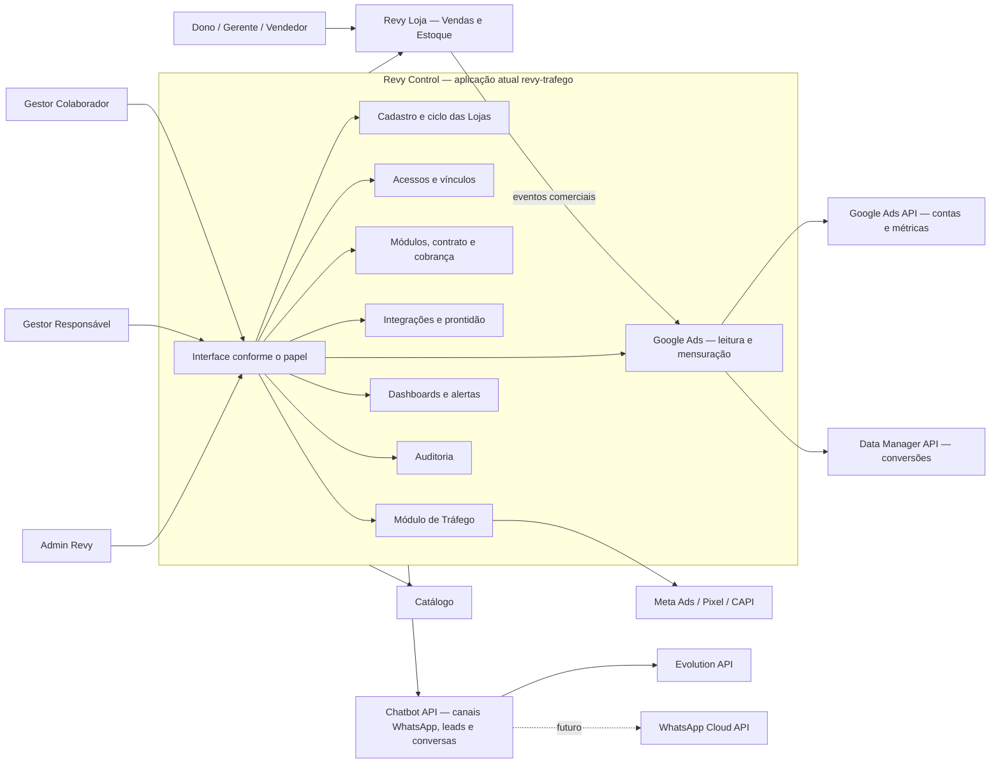

# Design — Revy Control

**Data:** 2026-07-29
**Status:** Aprovado para planejamento — não implementado
**Evolução de:** `revy-trafego`
**Vocabulário:** [`CONTEXT.md`](../../../CONTEXT.md)
**Pesquisa Google:** [`docs/nao-plano/research/2026-07-29-google-ads-revy-control.md`](../../research/2026-07-29-google-ads-revy-control.md)

## Resultado desejado

Evoluir o cockpit `revy-trafego` para o **Revy Control**, painel de controle do
ecossistema Revy. O módulo de Tráfego continua existindo e preserva suas funções
atuais, mas deixa de representar o produto inteiro.

O Revy Control é usado por Admins Revy e gestores de tráfego. Dono, gerente e
vendedor não entram nesse painel: eles acessam somente os módulos contratados dentro
do Revy Loja.

## Documentos substituídos

Este desenho substitui, para desenvolvimento futuro:

- as decisões D1 e D7 do design de 2026-07-28, que limitavam gestores à equipe Revy
  e davam acesso de qualquer gestor a todas as lojas;
- o plano de Multi-WhatsApp por vendedor de 2026-07-22, que vinculava cada número
  obrigatoriamente a vendedor e campanha.

Os documentos antigos permanecem como histórico do que foi implementado ou
considerado. A separação já concluída entre Revy Tráfego e Portal não será desfeita.

## Base já existente

O sistema atual já entrega:

- app `revy-trafego` com banco próprio, login, sessão e seletor multi-loja;
- Pixel, CAPI, Meta Ads, campanhas, gastos, ROI, auditorias e diagnóstico;
- API de resultados e recepção de eventos de venda do Portal;
- integração HTTP com Portal, Chatbot e Catálogo;
- isolamento das operações de mídia por `loja_slug`;
- Portal da loja sem as telas técnicas de tráfego;
- captura de `gclid` no Catálogo/Chatbot e no evento interno de conversão do Portal.

As lacunas principais são:

| Lacuna atual | Evidência no código |
|---|---|
| Loja não é cadastro de primeira classe no Revy Tráfego | `app/lojas.py` descobre slugs em tabelas e envs |
| Gestor pode escolher ou digitar qualquer slug | `app/templates/home.html` + `POST /app/loja` |
| `admin` e `gestor` existem, mas não governam as rotas | `GestorRevy.papel` sem autorização central |
| Usuário do Portal pertence a uma única loja e um único papel | `portal-gestao/app/models.py::Usuario` |
| Chatbot assume uma instância Evolution por loja | `chatbot-api/app/models_db.py::Loja` |
| `gclid` não chega ao evento de venda recebido pelo Revy Tráfego | `portal-gestao/app/revy_trafego_outbox.py` e `revy-trafego/app/api_v1.py` |
| `gbraid`/`wbraid`, OAuth Google, métricas GAQL e uploads não existem | não há adapter Google nos dois apps |
| Auditoria cobre principalmente diagnóstico de PII | `GestorAuditLog` |
| Rotas HTML estão concentradas em arquivo grande | `revy-trafego/app/main.py` |

## Decisões fechadas

1. Não existe entidade Organização. Cada cliente é uma **Loja** independente.
2. O mesmo dono pode estar vinculado a várias lojas, sem unir contrato, cobrança,
   configuração ou dados.
3. O **Admin Revy** tem acesso total e permanente ao Revy Control. Todas as suas
   alterações são auditadas.
4. Cada loja possui no máximo um **Gestor Responsável** e pode possuir vários
   **Gestores Colaboradores**.
5. Gestores podem ser da Revy, independentes ou integrantes de uma agência. O acesso
   é individual; não haverá entidade Agência ou Organização.
   A mesma pessoa pode também possuir cargo em uma Loja, mas as permissões das duas
   superfícies não se misturam.
6. O Gestor Responsável configura integrações. Colaboradores podem acompanhar
   campanhas, métricas e alertas, mas não desconectam integrações.
7. Configurações, campanhas e histórico ficam no escopo da loja. O autor de cada
   alteração permanece registrado.
8. O Revy Loja é um produto único com somente dois módulos visíveis: Vendas e Estoque.
   Eles podem ser contratados separadamente; Chatbot, Seller AI e Simulação
   Multibanco são capacidades embutidas em Vendas. Estoque permanece determinístico e sem IA.
9. Contrato e cobrança são independentes por loja. Na primeira versão, o Control
   apenas registra a situação; ele não processa pagamentos nem suspende automaticamente.
10. A Revy conecta contas Meta/Google que o gestor já está autorizado a acessar.
    Criar contas, conceder acesso, recuperar senha e operar anúncios fica fora da Revy.
11. Para Google, o Control usa Google Ads API somente para OAuth, contas, campanhas,
    métricas e ações de conversão. Conversões offline novas usam Data Manager API.
12. Ações de conversão são criadas e classificadas no Google pelo cliente/gestor; a
    Revy apenas mapeia eventos internos para ações existentes.
13. Pessoas, cargos, módulos e políticas de integração são configurações estruturais
    administradas no Control. O Chatbot persiste e opera os canais WhatsApp por trás da
    interface usada pelo Control. Distribuição e produtividade da equipe são operação da Loja.
14. Credenciais de portais bancários pertencem a Vendas no Revy Loja e ficam restritas
    a dono/gerente; elas nunca são administradas ou exibidas no Revy Control.
15. Uma loja pode ter vários números de WhatsApp equivalentes, sem finalidade fixa.
16. Um número pertence permanentemente a uma única loja, não é transferido e nunca é
    apagado; ao ser inativado, seu histórico permanece.
17. Evolution é o provedor inicial. O mesmo número pode migrar para WhatsApp Cloud API,
    mantendo identidade e histórico, com apenas um provedor ativo por vez.
18. Requisitos obrigatórios impedem a ativação da loja. Alertas não críticos podem ser
    aceitos pelo Admin e ficam auditados.
19. Suspensão interrompe automações e novos processamentos, mas preserva os dados.
20. Credencial bancária não é requisito de prontidão do Control; sua configuração e o
    estado da Simulação Multibanco pertencem a Vendas no Revy Loja.
21. Estado da Loja e entitlements são projetados de forma versionada e idempotente aos
    serviços operacionais; esconder uma interface não aplica suspensão.

Antes de implementar a suspensão distribuída, o plano deve fixar uma matriz por módulo
para leitura histórica, novas escritas, webhooks inbound, automações, jobs e Catálogo
Público. A regra geral de preservar histórico não autoriza cada serviço a inventar um
comportamento diferente.

## Fora de escopo deste desenho

- Definir as funcionalidades internas dos módulos Vendas e Estoque ou de suas
  capacidades embutidas.
- Criar, pausar ou editar anúncios dentro da Revy.
- Administrar login, 2FA ou permissões dentro de Meta e Google.
- Criar ações de conversão ou definir no Google se são primárias/secundárias.
- Administrar credenciais dos portais bancários usados na Simulação Multibanco.
- Processar pagamentos e emitir cobranças.
- Migrar imediatamente para WhatsApp Cloud API.
- Criar entidades Organização, Rede ou Agência.
- Vincular número de WhatsApp obrigatoriamente a vendedor, campanha ou finalidade.

Campanhas mostradas no Control são **Registros de Campanha** usados para atribuição,
gasto e resultado. Elas não representam comandos para criar ou alterar anúncios externos.

## Papéis e acesso

| Ação | Admin Revy | Gestor Responsável | Gestor Colaborador | Dono/Gerente/Vendedor |
|---|:---:|:---:|:---:|:---:|
| Ver todas as lojas | Sim | Não | Não | Não entra no Control |
| Ver lojas atribuídas | Sim | Sim | Sim | Não entra no Control |
| Criar/suspender/encerrar loja | Sim | Não | Não | Não |
| Configurar módulos, contrato e cargos | Sim | Não | Não | Não |
| Atribuir gestores | Sim | Não | Não | Não |
| Configurar/desconectar integrações técnicas | Sim | Sim | Não | Não |
| Consultar campanhas e resultados | Sim | Sim | Sim | Não |
| Conectar/reconectar/inativar WhatsApp | Sim | Sim | Não | Não |
| Administrar acessos bancários | Não | Não | Não | Somente dono/gerente, na Loja |
| Consultar auditoria | Sim | Apenas seu escopo | Apenas seu escopo | Não |

## Ciclo da Loja

```text
Rascunho → Em configuração → Pronta → Ativa
                                      ↓
                                  Suspensa
                                      ↓
                                  Encerrada
```

- Admin cria a loja e define módulos, pessoas e Gestor Responsável.
- Pelo menos um Dono da Loja deve poder ativar seu acesso antes de a loja ficar pronta.
- Gestor configura as integrações exigidas pelos módulos.
- O sistema calcula a prontidão; erro obrigatório impede avanço.
- Admin ativa a loja pronta.
- Suspensão e encerramento são explícitos e não apagam histórico.

## Arquitetura alvo



O diretório, processo e deploy `revy-trafego` permanecem inicialmente. A marca da UI
passa a ser Revy Control, e Tráfego vira uma área interna. Não haverá renomeação de
serviço durante a primeira migração.

## Módulos e interfaces

As rotas devem ser chamadores finos. A complexidade fica em módulos profundos com
interfaces pequenas e testadas.

| Módulo | Interface principal | Complexidade escondida |
|---|---|---|
| Cadastro de Lojas | criar, consultar, transicionar estado | invariantes, backfill, ativação e preservação histórica |
| Controle de Acesso | autorizar, atribuir, revogar, listar escopo | admin global, vínculos por loja, responsável único, múltiplos cargos |
| Portfólio Contratado | configurar contrato, módulos e situação | entitlement, vigência, requisitos por módulo |
| Central de Integrações | conectar, desconectar, consultar saúde/prontidão | credenciais, validação, alertas e adapters externos |
| Canais WhatsApp | cadastrar, conectar, reconectar, inativar, consultar estado | múltiplos números, vínculo imutável à loja e troca de provedor |
| Tráfego e Resultados | acompanhar mídia, registros de campanha, resultados e diagnóstico | implementação atual de Pixel/CAPI/Ads/ROI |
| Aquisição Google | conectar, sincronizar, mapear conversões e reconciliar | OAuth, hierarquia, GAQL, atribuição, outbox e diagnósticos |
| Trilha de Auditoria | registrar e consultar | ator, loja, recurso, antes/depois, motivo e data |

### Seams e adapters

- **Revy Control → Chatbot:** port de canais WhatsApp; adapter HTTP em produção e
  adapter em memória nos testes.
- **Chatbot → provedor WhatsApp:** port de provedor; `EvolutionAdapter` agora,
  adapter falso nos testes e `CloudApiAdapter` somente quando a migração for decidida.
- **Revy Control → Revy Loja:** contratos versionados de provisionamento e
  permissões; sem foreign keys entre bancos.
- **Control → serviços Revy:** projeção versionada de estado da loja e entitlements
  para Loja, Chatbot, Motor, Estoque e Catálogo; adapters HTTP/evento em produção e
  memória nos testes. Cada destino bloqueia novos processamentos quando suspenso.
- **Tráfego → Meta:** ports externos injetados; tokens não entram na interface das
  rotas nem nos logs.
- **Control → Google Ads API:** port somente leitura para contas, hierarquia, ações,
  campanhas e métricas; não existe port de `Mutate`.
- **Control → Data Manager API:** port de ingestão de eventos e consulta de diagnóstico.
- **Revy Loja → Control:** contrato versionado de evento comercial com `gclid`,
  `gbraid`, `wbraid`, consentimento, identificadores enhanced permitidos, valor,
  moeda e timestamp.

`app/main.py` deve ficar responsável por montagem da aplicação, middleware, lifespan e
inclusão de routers. Novas regras de negócio não devem ser acrescentadas diretamente
nele.

## Modelo de dados alvo

### Revy Control

| Entidade | Função |
|---|---|
| `lojas` | identidade imutável, slug, dados cadastrais e estado |
| `pessoas` | identidade única no ecossistema |
| `acessos_control` | autenticação e papel global do Admin/gestor |
| `cargos_loja` | dono, gerente e vendedor; vários cargos por pessoa/loja |
| `vinculos_trafego` | responsável ou colaborador por loja |
| `modulos_revy` | catálogo restrito aos módulos Vendas e Estoque |
| `loja_modulos` | módulo contratado e estado por loja |
| `contratos_loja` | valor, vigência e situação da cobrança |
| `integracoes_loja` | catálogo e projeção de saúde das integrações |
| `auditoria_eventos` | histórico administrativo e técnico imutável |
| `google_ads_connections` | OAuth cifrado, escopos, ator e estado da conexão |
| `google_ads_accounts` | customer/login IDs, moeda, fuso e conta selecionada |
| `google_ads_campaign_daily` | métricas diárias sincronizadas por campanha |
| `google_ads_conversion_bindings` | evento Revy → ação de conversão existente |
| `google_ads_conversion_outbox` | evento cifrado, transaction ID e estado de envio |
| `google_ads_upload_attempts` | request ID, diagnóstico, erro e tentativas |

O Gestor Responsável deve ter unicidade ativa por loja. A mesma pessoa pode acumular
cargos e atuar em várias lojas independentes.

As tabelas de mídia existentes continuam no banco do Revy Control. Elas recebem
referência gradual a `loja_id`; `loja_slug` permanece durante a migração para preservar
contratos HTTP e compatibilidade.

O `gclid` existente precisa atravessar o outbox Portal → Control. Catálogo, landing
pages e formulários passam também a preservar `gbraid` e `wbraid` sem transformá-los.
Click IDs e PII não aparecem em logs ou telas técnicas e seguem retenção definida.

## Google Ads

A integração usa duas fronteiras:

```text
Google Ads API  ──► contas + ações + campanhas + métricas ──► Revy Control
Data Manager API ◄── conversões da jornada comercial ◄────── Revy Loja
```

Fluxo de conexão:

1. Gestor Responsável/Admin inicia OAuth no backend do Control.
2. Callback valida `state`, guarda refresh token cifrado e descobre contas acessíveis.
3. Usuário escolhe explicitamente a conta anunciante e, quando necessário, a manager
   usada como `login_customer_id`.
4. O Control valida moeda, fuso, auto-tagging, ações e prontidão.
5. Jobs usam GAQL para sincronizar somente os campos necessários.

Fluxo de conversão:

1. Revy Loja confirma um evento comercial e grava seu outbox transacional.
2. Control recebe o evento e resolve o vínculo com uma ação existente no Google.
3. Um `transaction_id` determinístico impede duplicidade em retries.
4. Data Manager API recebe lote por loja/ação/janela.
5. Control guarda o `request_id` e consulta o diagnóstico assíncrono até sucesso,
   sucesso parcial ou falha reconciliada.

Enhanced conversions for leads usam somente dados first-party permitidos e
consentidos, normalizados e hasheados no backend. Falha ou atraso do Google nunca
reverte a venda no Revy Loja.

## Chatbot API

O Chatbot continua dono operacional e persistente de canais, conversas, mensagens e leads.
O Revy Control administra os canais por port HTTP e conserva apenas a projeção necessária
de estado, saúde e prontidão:

- `whatsapp_canais`: número, loja, estado e identidade do canal;
- `whatsapp_conexoes`: histórico de conexões e provedor; uma ativa por número;
- `conversas`: passa a distinguir `(canal_id, telefone_cliente)`;
- `mensagens`: deduplica por `(canal_id, provider_message_id)`;
- `leads`: continua único por `(loja_id, telefone_cliente)`.

`NumeroAutorizado` continua sendo o telefone de uma pessoa autorizada a operar estoque
via WhatsApp. Ele não é um `Número WhatsApp da Loja` e não deve ser migrado para a tabela
de canais.

## Telas

### Admin Revy

- Dashboard geral: lojas por estado, onboardings, módulos, falhas e responsável.
- Lojas: cadastro, status e ativação.
- Detalhe da loja: módulos, pessoas/cargos, gestores, integrações, contrato e auditoria.
- Módulos Revy Loja: Vendas, Estoque e seus requisitos.
- Auditoria global.

Usuários e números são configurações do detalhe da loja, não cards do dashboard.

### Gestor de Tráfego

- Dashboard das lojas atribuídas.
- Integrações Meta/Google e números WhatsApp.
- Campanhas, gastos, resultados, funil e diagnóstico.
- Alertas de medição e conexão.

Não há tela de credencial bancária no Control.

## Segurança e auditoria

- Autorização sempre no backend; esconder menu não concede segurança.
- Toda operação recebe `loja_id` do contexto autorizado, nunca de input confiado.
- Slug digitado manualmente deixa de conceder acesso.
- Tokens permanecem cifrados e nunca retornam ao navegador após gravação.
- Convites de acesso são de uso único e expiram; cada pessoa define a própria senha.
  Admin pode revogar acesso e sessões, mas nunca conhecer ou reapresentar a senha.
- OAuth usa `state`, acesso offline e callback HTTPS; revogação/expiração viram estados
  normais da conexão.
- O código Google expõe consultas e ingestão de eventos, mas nenhum comando de campanha.
- PII só entra em enhanced conversions com consentimento aplicável e nunca entra em log.
- Operações administrativas e técnicas registram ator, loja, ação, recurso e resultado.
- Não há exclusão física de Loja, Módulo Contratado, vínculo histórico ou canal WhatsApp.
- Testes obrigatórios de isolamento cruzado entre lojas e gestores.

## Compatibilidade e migração

Usar expand/contract e strangler:

1. Criar catálogo de lojas e vínculos sem remover `loja_slug`.
2. Backfill a partir das lojas e dados atuais.
3. Trocar o seletor livre por consultas autorizadas.
4. Introduzir pessoas, cargos, módulos e contratos.
5. Expor a Central de Integrações sobre as configurações existentes.
6. Adicionar Google Ads: OAuth/leitura, captura completa e Data Manager API.
7. Migrar WhatsApp de uma instância por loja para canais, inicialmente com um canal legado.
8. Somente depois remover fallbacks por env e campos legados.

Rollback seguro desliga interfaces novas e mantém schema aditivo. Nenhum rollout deve
apagar ou colapsar dados multi-loja ou multi-canal.

## Critérios de sucesso

1. Admin cria e ativa uma loja sem editar envs ou banco manualmente.
2. Gestor enxerga somente lojas explicitamente atribuídas.
3. Uma agência pode usar usuários individuais sem existir como Organização.
4. Módulos e cobrança permanecem independentes por loja.
5. Loja conecta pelo menos dois números equivalentes sem misturar mensagens ou leads.
6. Troca futura de provedor WhatsApp não altera a identidade do número nem seu histórico.
7. Portal, ROI, CAPI, Catálogo e operação atual continuam funcionando durante a migração.
8. Toda mudança administrativa ou técnica relevante pode ser atribuída a um ator.
9. Google sincroniza investimento e métricas sem chamar métodos de mutação.
10. Conversões Google são idempotentes, consentidas e possuem diagnóstico rastreável.
11. Nenhum usuário do Control acessa credenciais dos portais bancários da Loja.
12. Suspender Loja ou Módulo interrompe novos processamentos em todos os serviços
    correspondentes sem apagar o histórico.
