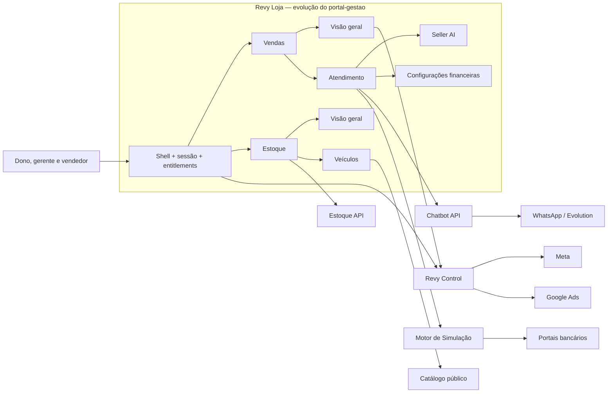

# Design — Revy Loja

**Data:** 2026-07-29
**Status:** Aprovado para planejamento — não implementado
**Evolução de:** `portal-gestao`
**Vocabulário:** [`CONTEXT.md`](../../../CONTEXT.md)
**Plano:** [`docs/referencia-viva/planos/2026-07-29-plano-revy-loja.md`](../../plans/2026-07-29-plano-revy-loja.md)

## Resultado desejado

Evoluir o Portal atual para o **Revy Loja**, aplicação operacional única de dono,
gerente e vendedor. Não será criado outro produto nem feita uma reescrita: o shell,
as integrações HTTP e as capacidades que já funcionam serão reorganizados em dois
módulos visíveis:

1. **Vendas**
   - Visão geral
   - Atendimento
2. **Estoque**
   - Visão geral
   - Veículos

Chatbot, Seller AI e Simulação Multibanco são capacidades de Vendas. O catálogo
público é uma saída do Estoque. Nenhum deles vira um terceiro módulo principal.

## Diagnóstico do código atual

O sistema já possui a maior parte da fundação funcional da primeira versão:

| Capacidade | Situação atual | Destino no Revy Loja |
|---|---|---|
| Dashboard, funil, metas, relatórios e resultados | Implementados em telas separadas | Vendas → Visão geral |
| Leads, conversas e handoff | Implementados pelo Portal + Chatbot API | Vendas → Atendimento |
| Vendas e atribuição | Implementadas no Portal; venda é projetada ao Revy Tráfego | Vendas → Atendimento/Visão geral |
| Simulação Multibanco | Fan-out e quatro drivers reais no Motor | Embutida no atendimento |
| Chatbot | Qualifica, solicita simulação e transfere ao vendedor | Capacidade embutida de Vendas |
| Estoque | CRUD, fotos, estados, reserva e venda | Estoque → Veículos |
| Catálogo público | Publicação e atribuição integradas ao Estoque | Saída do cadastro de veículos |
| Acessos bancários | Protegidos no Portal | Configuração financeira contextual de Vendas |
| Equipe | Cadastro e papéis ainda mantidos no Portal | Estrutura migra ao Control; operação permanece na Loja |
| Seller AI | Não existe | Nova capacidade, depois do núcleo operacional |

Baseline verificado antes deste desenho: **809 testes passando** — Chatbot 170,
Portal 293, Estoque 87, Catálogo 37 e Motor 222 — além dos workflows canônico e de
teste do n8n válidos.

As principais lacunas não exigem reconstruir o produto:

- navegação e telas ainda refletem produtos separados;
- vendedor ainda não possui um workspace único da negociação;
- distribuição existe, mas não governa toda a visibilidade operacional;
- identidade atual suporta um papel e uma loja por conta;
- multi-WhatsApp ainda pressupõe uma instância por loja;
- não existem próxima ação, follow-up, proposta e Seller AI como domínio completo;
- configurações técnicas de Meta, Google e WhatsApp ainda precisam migrar ao Control.

## Decisões fechadas

1. O Revy Loja evolui `portal-gestao`; não haverá um frontend ou backend paralelo.
2. Somente Vendas e Estoque aparecem como módulos principais.
3. Vendas possui somente Visão geral e Atendimento.
4. Estoque possui somente Visão geral e Veículos.
5. Chatbot, Seller AI e Simulação Multibanco ficam dentro do fluxo de Atendimento.
6. O Chatbot pode solicitar a Simulação Multibanco. O vendedor continua responsável
   por apresentar condições ao cliente.
7. Estoque não utiliza IA. Seus indicadores são determinísticos.
8. O Revy Control é a autoridade administrativa da estrutura da loja: pessoas, cargos,
   módulos contratados, gestores de tráfego e políticas de integração. A conexão de
   WhatsApp é comandada por ele, mas os canais e sua operação pertencem ao Chatbot.
9. O Revy Loja usa a equipe provisionada pelo Control para distribuir e acompanhar
   trabalho, mas não cria contas nem altera cargos estruturais.
10. Credenciais dos portais bancários permanecem no Revy Loja, protegidas no domínio
    de Vendas e acessíveis somente a dono e gerente. Elas não pertencem ao gestor de
    tráfego e nunca são exibidas no Revy Control.
11. A configuração de Meta, Google, tokens, webhooks e conexão de números aparece
    somente no Revy Control. O Revy Loja recebe apenas resultados de aquisição e saúde
    que façam sentido para a operação comercial.
12. Serviços existentes continuam donos de seus dados e são acessados por contratos
    HTTP/eventos; não haverá banco compartilhado entre aplicações.
13. Telas antigas só deixam a navegação depois de sua função existir no novo destino.
    O cutover usa flags e redirects, sem big bang.
14. Estado da Loja e entitlements recebidos do Control são aplicados no backend. Loja ou
    módulo suspenso bloqueia novo processamento sem apagar o histórico autorizado.
15. Falta de credencial bancária é pendência operacional de Vendas e não impede a
    ativação estrutural da Loja no Control.
16. O primeiro Atendimento unificado inclui envio humano de texto pela conversa. O
    Chatbot persiste e envia a mensagem; o Revy Loja autoriza, audita e impede troca
    arbitrária de loja/canal. Envio de mídia permanece posterior.

## Decisão pendente antes do corte de RBAC

Definir a visibilidade exata do vendedor. A política inicial recomendada é:

- dono e gerente enxergam toda a operação da loja;
- vendedor enxerga seus atendimentos, simulações e vendas;
- vendedor enxerga o estoque disponível, sem custo e margem;
- fila sem responsável pode ser visível conforme regra de distribuição da loja.

Essa recomendação não deve ser aplicada silenciosamente: precisa de aceite do produto
antes da Fase 4 do plano.

## Limite entre Control e Loja

| Responsabilidade | Revy Control | Revy Loja |
|---|:---:|:---:|
| Criar, ativar, suspender e encerrar loja | Sim | Não |
| Criar pessoa e atribuir cargo estrutural | Sim | Não |
| Habilitar Vendas/Estoque no contrato | Sim | Consome entitlement |
| Conectar Meta, Google e números WhatsApp | Sim | Não |
| Ver campanhas, aquisição, CAC e ROAS detalhados | Sim | Resumo comercial |
| Distribuir lead e medir atendimento | Não | Sim |
| Conversar, negociar, simular e vender | Não | Sim |
| Configurar credenciais de portais bancários | Não | Dono/gerente |
| Cadastrar e publicar veículo | Não | Sim |

## Arquitetura alvo

O Revy Loja continua sendo um BFF/shell. Ele compõe dados remotos, aplica as
permissões operacionais e mantém somente os dados que pertencem à negociação e à
gestão comercial.

## Módulos e interfaces

| Módulo profundo | Interface pequena | Complexidade escondida |
|---|---|---|
| Shell e Entitlements | resolver pessoa, loja, cargos e módulos | projeção do Control, sessão, fallback e cutover |
| Visão Geral de Vendas | consultar período e KPIs | funil, vendas, metas, SLA, aquisição e alertas |
| Workspace de Atendimento | listar fila, abrir cliente, atribuir, enviar texto, registrar ação | leads, conversa, handoff, canal, idempotência, simulação, proposta e venda |
| Configurações Financeiras | listar e atualizar acessos autorizados | cifra, mascaramento, banco e auditoria |
| Visão Geral de Estoque | consultar indicadores | estados, idade, procura e pendências |
| Operação de Veículos | criar, editar, publicar, reservar e vender | Estoque API, mídia, idempotência e catálogo |
| Seller AI | resumir e sugerir | contexto permitido, grounding, auditoria e fallback |
| Projeção do Control | sincronizar identidade e entitlements | contrato versionado, idempotência e indisponibilidade |

Rotas e templates não devem chamar fornecedores diretamente. Cada integração mantém
um port e dois adapters: HTTP em produção e memória/fake em testes.

## Propriedade dos dados

| Sistema | Continua dono de |
|---|---|
| Revy Control | loja, pessoa, cargos estruturais, módulos, políticas técnicas e projeções de saúde |
| Revy Loja/Portal | vendas, metas, atribuição operacional e novos artefatos da negociação |
| Chatbot API | canais WhatsApp, conexões de provedor, leads, conversas, mensagens e handoff |
| Motor de Simulação | credenciais bancárias cifradas, solicitações, resultados e eventos |
| Estoque API | veículos, fotos, preço, custo, disponibilidade e publicação |
| Catálogo Público | renderização pública, sessões e eventos de navegação |

Novos artefatos de negociação que pertencem ao Revy Loja:

- `proximas_acoes`;
- `followups`;
- `propostas`;
- `seller_ai_execucoes` com entrada resumida, sugestão, modelo, autor e resultado.

O texto integral da conversa continua no Chatbot. O Revy Loja não duplica histórico
apenas para alimentar IA.

## Experiência de uso

### Vendas → Visão geral

- receita, margem, vendas e metas;
- leads novos, aguardando resposta e sem responsável;
- SLA e produtividade;
- funil resumido;
- origem, investimento, CAC e ROAS recebidos do Control;
- próximas ações e alertas acionáveis.

Detalhes técnicos de Pixel, tokens, OAuth, webhooks e diagnóstico não aparecem.

### Vendas → Atendimento

Lista e detalhe formam um único workspace:

- dados e interesse do cliente;
- conversa e canal utilizado;
- composer humano de texto no canal da conversa;
- responsável e etapa;
- resumo do Chatbot;
- Simulação Multibanco e resultados;
- próxima ação, follow-up e proposta;
- confirmação de venda;
- sugestões do Seller AI, sempre revisáveis pelo vendedor.

### Estoque → Visão geral

- totais por disponibilidade;
- veículos parados por faixas de dias;
- procura por modelo;
- cadastros sem preço, foto ou informação obrigatória;
- reservas e vendas recentes.

Todos os números vêm de regras explícitas, sem inferência por IA.

### Estoque → Veículos

Reaproveita CRUD, fotos, preço, custo, estados e publicação existentes. Clientes
interessados podem ser acessados a partir do veículo, mas a negociação abre no
Atendimento.

### Configurações financeiras

Não aparece como módulo ou item principal. Fica como ação contextual protegida em
Vendas, somente para dono e gerente. Senhas nunca são reapresentadas em claro; troca,
teste e auditoria seguem os controles já usados pelo Motor.

## Seller AI

O Seller AI começa como copiloto, não como agente autônomo:

- resume conversa e dados da negociação;
- sugere resposta;
- recomenda próxima ação e prazo;
- identifica informação faltante;
- prepara rascunho de follow-up ou proposta.

Ele não altera estoque, preço, margem, etapa, responsável ou resultado financeiro sem
uma ação explícita e autorizada. Dados de estoque, simulação e permissões vêm das APIs
determinísticas. Falha da IA nunca bloqueia Atendimento, Simulação ou Venda.

## Compatibilidade e migração

1. Criar o novo shell e os entitlements atrás de flags.
2. Compor telas existentes nas quatro áreas novas sem remover rotas antigas.
3. Migrar a estrutura de usuários/cargos ao Control e manter projeção compatível.
4. Consolidar o Atendimento e só então redirecionar Leads, Conversas, Simulações e Vendas.
5. Mover configurações técnicas para o Control quando cada equivalente estiver pronto.
6. Adaptar a interface a múltiplos canais depois da fase Multi-WhatsApp do Control.
7. Introduzir Seller AI por último, sobre dados e permissões já estáveis.

## Fora de escopo

- operar ou alterar campanhas de anúncios;
- configurar Meta, Google ou WhatsApp dentro do Revy Loja;
- aprovar financiamento em nome de banco;
- enviar automaticamente ao cliente condições financeiras sem regra aprovada;
- IA no Estoque;
- banco de dados compartilhado entre serviços;
- reescrever Chatbot, Motor, Estoque ou Catálogo;
- migrar imediatamente para WhatsApp Cloud API.

## Critérios de sucesso

1. Usuário encontra toda a operação em quatro áreas, sem perder capacidade existente.
2. Dono e gerente acompanham aquisição até venda sem acessar configurações técnicas.
3. Vendedor trabalha a negociação em um único workspace conforme seu escopo aprovado.
4. Chatbot solicita Simulação Multibanco e transfere contexto completo ao vendedor.
5. Credenciais bancárias permanecem protegidas e invisíveis ao gestor de tráfego.
6. Estoque e catálogo continuam operacionais, determinísticos e sem IA.
7. Indisponibilidade do Control ou da IA degrada de forma segura, sem apagar dados.
8. As 809 verificações existentes permanecem passando durante a migração.
