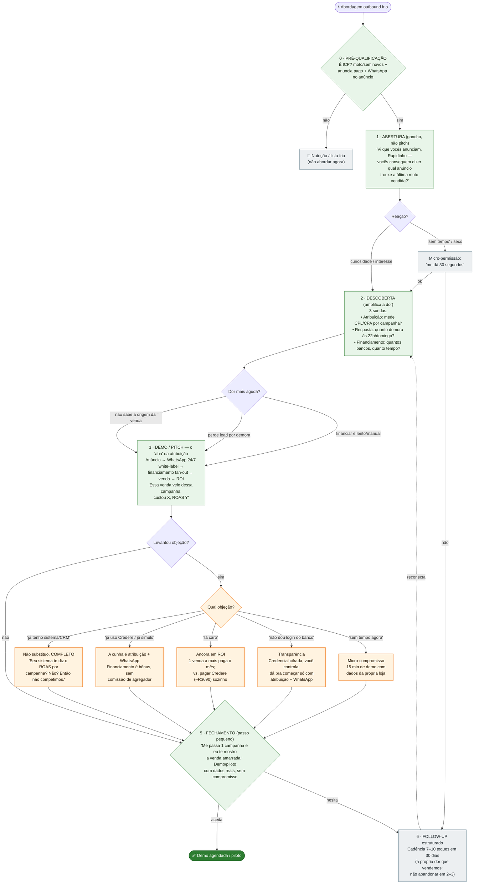

# Script de venda — outbound frio (Revy/HEVY)

_Atualizado em 2026-08-09._ Roteiro consultivo (estilo SPIN: pergunta antes de pitchar)
para abordar **revendas de moto/seminovos a frio**. Deriva da
[análise de mercado e fit](../mercado/README.md).

**Princípio que rege o script:** a **atribuição** (anúncio → WhatsApp → venda → ROI) é a
única coisa que nenhum concorrente faz — então é ela que abre a porta. Financiamento e
estoque entram como reforço ("e ainda faz isso"), **nunca** como manchete: financiamento é
paridade (Credere/AutoConf/Boom já fazem) e estoque é commodity.

**ICP (filtro da etapa 0):** revenda de **moto/seminovos, porte médio (30–200 unidades)**,
que **já roda tráfego pago** e **financia venda**. Fora disso → nutrir, não abordar agora.

## Fluxo da conversa

## Talk track (as falas, por bloco)

**0 · Pré-qualificação** — antes de gastar energia, confirme: anuncia pago? é moto/seminovos?
tem volume? Fora do ICP, entra na nutrição.

**1 · Abertura** — não pitcheie. Uma pergunta que expõe a dor nº 1:
> "Vi que vocês anunciam no [Meta/portal]. Rapidinho: vocês conseguem dizer hoje qual anúncio
> trouxe a última moto que venderam?"

Quase sempre a resposta é "não". Esse "não" é a abertura.

**2 · Descoberta** — três sondas para achar a dor mais aguda (ancore o pitch nela):
- Atribuição: *"Quando entra lead no WhatsApp, você sabe de qual campanha veio? Mede CPL/CPA?"*
- Resposta: *"Um lead que chega 22h ou domingo — quanto tempo até alguém responder?"*
- Financiamento: *"Pra fechar financiado, quantos bancos você simula e quanto tempo leva?"*

**3 · Demo/Pitch** — mostre o "aha" na tela: uma venda com a campanha amarrada, CPL/CPA/ROAS
sem planilha. Reforce **white-label** (nome da loja) e **moto-first**. Financiamento entra como
*"e ainda simula seus bancos sozinho, sem redigitar cadastro"*.

**4 · Objeções** — rebata e volte ao fechamento (ver diagrama). A mais comum, "já tenho
sistema", nunca é confronto: *"não substituo seu sistema, completo — ele te diz o ROAS por
campanha?"*.

**5 · Fechamento** — peça um passo pequeno e concreto, não assinatura:
> "Me passa uma campanha sua e eu te mostro a venda amarrada. 15 minutos, sem compromisso."

**6 · Follow-up** — se não fechou, cadência de 7–10 toques em 30 dias. Não abandone em 2–3
(é literalmente a dor que você vende).

---
_Fonte da estratégia: [`docs/mercado/README.md`](../mercado/README.md) e as duas pesquisas
citadas lá._
