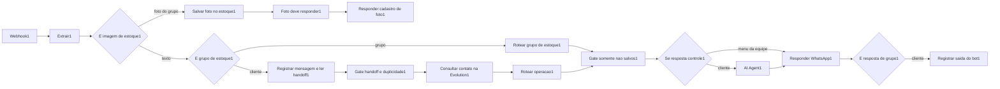

# Guia do workflow da Vitor Motos

Este guia descreve o arquivo `workflow-ai-nao-salvos.json`, que é a fonte principal.
O fluxo de teste é gerado a partir dele e atende somente o número configurado em
`build_test_workflow.js`.

## Regra mais importante

Edite o arquivo principal. Não edite os arquivos `workflow-fly*.ready.json`: eles
são gerados com endereços e credenciais locais apenas na hora da publicação.

## Multi-WhatsApp (um workflow)

- A Evolution envia `body.instance` em todo webhook.
- `Extrair1` propaga `instance`; eventos sem instance são descartados.
- Chamadas Evolution usam a instance do evento (não há `__INSTANCE__` fixo).
- O Chatbot resolve loja/canal por instance; conversa e handoff são por canal.
- Placeholders de deploy: só `__EVOLUTION_KEY__`, `__CHATBOT_TOKEN__`,
  `__CHATBOT_WEBHOOK_TOKEN__` (e URLs). **Um workflow serve N números.**

O fluxo atual tem 26 nós e trabalha com:

- mensagens de texto de clientes;
- contexto de anúncios;
- consulta e fotos do estoque;
- cadastro de estoque pela equipe;
- simulação e criação de lead qualificado;
- encaminhamento para atendimento humano.

Áudios estão desativados. O nó `Extrair1` identifica `audioMessage` e encerra a
execução sem registrar, chamar a IA ou responder.

## Visão geral



## O caminho de uma mensagem de cliente

1. `Webhook1` recebe o evento da Evolution.
2. `Extrair1` aceita apenas mensagem privada ou o grupo autorizado, ignora
   eventos técnicos, reações, saídas do próprio bot e áudios.
3. `E imagem de estoque1` separa fotos do grupo de estoque.
4. `E grupo de estoque1` separa operação da equipe de conversa de cliente.
5. `Registrar mensagem e ler handoff1` grava a entrada no CRM e devolve
   `bot_ativo`, `primeira_mensagem`, **`tem_saida`** (já houve resposta na conversa)
   e **`historico_recente`** (últimas msgs compactas para o prompt).
6. `Gate handoff e duplicidade1` encerra duplicatas e `fromMe` que não devem
   continuar.
7. `Consultar contato na Evolution1` + `Normalizar isSaved Evolution1` → `isSaved`
   (agenda) e `chatFound` (chat no WA). Lista vazia ⇒ `isSaved: null` (desconhecido).
8. `Rotear operacao1` → `/v1/operacao/roteamento` com `is_saved` e `chat_found`.
   Backend (defesa em profundidade): só `is_saved === true` bloqueia por agenda;
   `null` é **fail-open** (atende lead novo/CTWA se não houver prova de histórico);
   conversa com saída segue `cliente`; `chat_found` no primeiro contato → `ignorar`.
9. `Gate somente nao salvos1` — função **`atendeLeadVirgem()`** (juiz fino n8n):
   cala em handoff, agenda (`isSaved true`) ou `chatFound` sem `tem_saida`; atende
   virgem/Evolution cega e multi-msg rápida; se `tem_saida` e bot ativo, continua.
   Aplica a tranca também quando o backend manda `acao=cliente` (não só no fallback).
10. `Se resposta controle1` manda menus da equipe direto ao WhatsApp; clientes
    seguem para a IA.
11. `AI Agent1` usa system message com **prioridade da `mensagem_atual`** e user
    prompt com **`historico_recente`** (CRM) + flags de anúncio/primeira msg.
12. `Responder WhatsApp1` envia a resposta.
13. `Registrar saida do bot1` grava no CRM a mensagem enviada ao cliente.

## O caminho da equipe e das fotos

- Mensagem no grupo autorizado: `Rotear grupo de estoque1`.
- Foto no grupo: `Salvar foto no estoque1`.
- `Foto deve responder1` evita confirmação quando a foto foi ignorada.
- `Responder cadastro de foto1` confirma somente uma foto aceita.
- Menus e respostas de controle não passam pela IA.

Essa separação é intencional: impede que uma mensagem comum altere o estoque.

## O Agent e suas ferramentas

O texto de comportamento fica em:

`AI Agent1` → `Options` → `System Message`

Ferramentas conectadas:

| Ferramenta | Responsabilidade |
|---|---|
| `consultar_estoque1` | Consulta estoque real e guarda uma moto quando a busca específica retorna uma única opção. |
| `enviar_foto_veiculo1` | Envia até quatro fotos usando somente o ID retornado pelo estoque. |
| `simular1` | Recupera a moto escolhida, valida CPF/nascimento/entrada, cria o lead qualificado e avisa o vendedor. |
| `solicitar_handoff1` | Pausa o bot, avisa o vendedor ativo e envia o link do CRM quando o cliente pede uma pessoa ou ocorre uma falha real. |
| `cadastrar_veiculo1` | Cadastra veículo quando a mensagem veio da equipe autorizada. |

O modelo usado fica em `Google Gemini Chat Model1`. A memória fica em
`Memoria da conversa1` e guarda as últimas 20 mensagens da sessão.

## Regras da simulação

- Antes de uma moto específica ser escolhida, o bot pergunta somente qual moto o
  cliente quer simular.
- CPF, nascimento e entrada só são pedidos depois da escolha.
- Uma busca específica com resultado único guarda os dados internos da moto.
- Uma mensagem com CPF, data e entrada é normalizada pela ferramenta.
- A placa é interna e nunca deve ser pedida ao cliente.
- O lead nasce somente dentro de `simular1`, já como `qualificado`.
- O bot continua ativo e o vendedor recebe um aviso sem CPF ou nascimento.
- No handoff explícito, o bot é pausado e o vendedor recebe o link da conversa.

## Onde mexer

| Mudança desejada | Local |
|---|---|
| Tom de voz, frases e regras | `AI Agent1` → `System Message` |
| Primeira mensagem / prioridade do pedido | seções `prioridade absoluta` e `primeiro contato` |
| Histórico no prompt | registrar (`historico_recente`) + template `text` do Agent |
| Tranca virgem / handoff / fail-open | `Gate somente nao salvos1` (`atendeLeadVirgem`) + backend `decidir_roteamento` |
| Comportamento de anúncio | seção `mensagem de anúncio` |
| Busca e seleção da moto | `consultar_estoque1` |
| Criação do lead e aviso ao vendedor | `simular1` |
| Resposta final no WhatsApp | `Responder WhatsApp1` |
| Filtro do número de teste | constantes no início de `build_test_workflow.js` |
| Reativar áudio no futuro | criar um ramo depois de `Extrair1`; não misturar com o caminho de texto |
| Teste da tranca sem rede | `node n8n/test_gate_somente_nao_salvos.js` |

## Arquivos do workflow

- `workflow-ai-nao-salvos.json`: **oficial de produção** — nome `WhatsApp IA - Somente Nao Salvos`,
  webhook `whatsapp-ai`, contatos não salvos + grupo de estoque, **jornada de catálogo**
  (fotos antes de simular). Placeholders de secret no prepare-workflow.
- `build_test_workflow.js`: gera a cópia restrita a partir do oficial (só freios de lab:
  1 telefone, sem grupos, webhook `whatsapp-ai-teste`).
- `workflow-teste-numero-autorizado.json`: cópia de teste gerada (não usar no número da loja).
- `validate_workflow.py`: protege as regras do fluxo oficial.
- `validate_test_workflow.py`: garante que o teste continue restrito.

## Validar e publicar

Na raiz do projeto:

```powershell
python n8n\validate_workflow.py
node n8n\build_test_workflow.js
python n8n\validate_test_workflow.py
```

Para preparar e publicar o teste:

```powershell
& 'deploy\fly\3vm\prepare-workflow.ps1' -Mode test
& 'deploy\fly\3vm\upload-and-import-workflow.ps1' -Mode test
fly apps restart n8n2037
```

Sempre valide antes de publicar. O workflow de teste deve continuar limitado ao
número definido no gerador.

## Roteiro de teste

1. Envie uma saudação: deve apresentar a Vitor Motos.
2. Peça para ver motos: não deve criar lead.
3. Escolha uma moto específica.
4. Confirme que quer simular.
5. Envie CPF, nascimento e entrada juntos.
6. O bot não deve repetir a pergunta.
7. O CRM deve criar um lead `qualificado`.
8. O vendedor deve receber o aviso interno.
